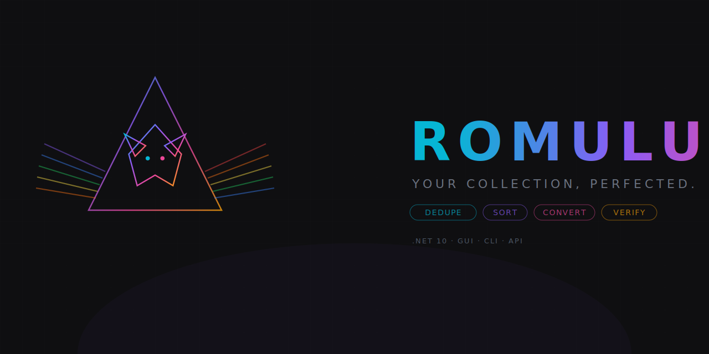

# Romulus

<p align="center">
  
</p>

<p align="center">
  <strong>Your Collection, Perfected.</strong><br/>
  C# .NET 10 Tool zur ROM-Sammlungsverwaltung: regionsbasierte Deduplizierung, Entrümpelung, Formatkonvertierung, DAT-basierte Verifizierung und Konsolen-Sortierung.
</p>

<p align="center">
  <strong>GUI</strong> (WPF/XAML) · <strong>CLI</strong> (headless/CI) · <strong>REST API</strong> (ASP.NET Core Minimal API)
</p>

---

## Features

| Feature | Beschreibung |
|---|---|
| **Region Dedupe** | Behält pro Spiel die beste ROM-Variante (Region, Version, Format, Größe). Priorität konfigurierbar (z.B. EU > US > JP). |
| **Junk-Entfernung** | Entfernt Demos, Betas, Protos, Bad Dumps, Trainer, Hacks etc. automatisch. |
| **BIOS-Trennung** | Sortiert BIOS/Firmware-Dateien in separaten Ordner. |
| **Format-Konvertierung** | CUE/BIN → CHD, ISO → CHD/RVZ, Cartridge → ZIP. Externe Tools: chdman, dolphintool, 7z. |
| **DAT-Matching** | Verifiziert ROMs gegen No-Intro, Redump, FBNEO DATs (SHA1/MD5/CRC32). Parent/Clone-Auflösung. |
| **1G1R-Modus** | One Game One ROM via Parent/Clone-Listen aus DAT-Dateien. |
| **Konsolen-Sortierung** | Sortiert Dateien automatisch nach 100+ Konsolen (Erkennung via Extension, Ordnername, DAT). |
| **Audit & Rollback** | SHA256-signierte Audit-CSVs mit vollständiger Rückverfolgbarkeit. |
| **DryRun** | Vorschau aller Aktionen ohne Dateien zu verschieben — HTML/CSV-Reports. |

---

## Systemanforderungen

- **Windows** 10/11
- **.NET 10 SDK** (net10.0)
- **Optionale Tools** (für Konvertierung):
  - [chdman](https://www.mamedev.org/) — CHD-Konvertierung (PS1, PS2, Saturn, Dreamcast)
  - [DolphinTool](https://dolphin-emu.org/) — RVZ-Konvertierung (GameCube, Wii)
  - [7-Zip](https://www.7-zip.org/) — Archiv-Handling (Cartridge-ROMs)

---

## Quick Start

### GUI (WPF)

```bash
dotnet run --project src/Romulus.UI.Wpf
```

1. **ROM-Ordner hinzufügen** — Drag & Drop oder Button.
2. **Modus wählen** — `DryRun` für Vorschau, `Move` für echte Änderungen.
3. **Starten** — Erster Lauf immer als DryRun empfohlen.
4. **Report prüfen** — HTML/CSV-Report zeigt alle geplanten/durchgeführten Aktionen.

### CLI (headless)

```bash
# DryRun — nur Vorschau
dotnet run --project src/Romulus.CLI -- --roots "D:\Roms" --mode DryRun

# Move — Dateien verschieben
dotnet run --project src/Romulus.CLI -- --roots "D:\Roms" --mode Move --regions EU,US
```

**Exit Codes:** `0` = Erfolg, `1` = Fehler, `2` = Abgebrochen, `3` = Preflight fehlgeschlagen.

### REST API

```bash
dotnet run --project src/Romulus.Api
```

API ist auf `127.0.0.1:7878` gebunden. Authentifizierung via `X-Api-Key`-Header (Wert aus Env-Variable `ROM_CLEANUP_API_KEY`).

---

## REST API — Endpunkte

| Methode | Pfad | Zweck |
|---------|------|-------|
| `GET` | `/health` | Health-Check |
| `GET` | `/openapi` | OpenAPI-Spec |
| `POST` | `/runs` | Run erstellen |
| `GET` | `/runs/{id}` | Run-Status abfragen |
| `GET` | `/runs/{id}/result` | Vollständiges Ergebnis |
| `POST` | `/runs/{id}/cancel` | Run abbrechen |
| `GET` | `/runs/{id}/stream` | SSE-Fortschrittsstream |

### Beispiel: Run starten

```bash
curl -X POST http://127.0.0.1:7878/runs \
  -H "X-Api-Key: your-key" \
  -H "Content-Type: application/json" \
  -d '{"roots": ["D:\\Roms\\SNES"], "mode": "DryRun", "preferRegions": ["EU","US"]}'
```

### API-Sicherheit

- **Auth:** `X-Api-Key`-Header, Fixed-Time-Comparison
- **Rate Limiting:** 120 Requests/Minute (Sliding Window)
- **CORS:** `strict-local` (Default), `local-dev`, `custom`
- **Body Size:** max. 1 MB
- **Binding:** ausschließlich `127.0.0.1`

---

## Projektstruktur

```
src/
├── Romulus.Contracts/        # Port-Interfaces, Models, Error-Contracts
│   ├── Errors/                  #   OperationError, ErrorKind, ErrorClassifier
│   ├── Models/                  #   RomCandidate, DatIndex, Settings, DTOs
│   └── Ports/                   #   IFileSystem, IAuditStore, IToolRunner, ...
├── Romulus.Core/             # Pure Domain Logic (keine I/O-Deps)
│   ├── Caching/                 #   LruCache<TKey,TValue>
│   ├── Classification/          #   ConsoleDetector, FileClassifier, ExtensionNormalizer
│   ├── Deduplication/           #   DeduplicationEngine (Winner-Selection)
│   ├── GameKeys/                #   GameKeyNormalizer (Tag-Parsing, Region-Scoring)
│   ├── Regions/                 #   RegionDetector
│   ├── Rules/                   #   RuleEngine
│   ├── Scoring/                 #   FormatScorer, VersionScorer
│   └── SetParsing/              #   CueSetParser, GdiSetParser, CcdSetParser, M3uPlaylistParser
├── Romulus.Infrastructure/   # I/O-Adapter & Services
│   ├── Analysis/                #   Collection-/DAT-/Integrity-Analyse
│   ├── Audit/                   #   AuditCsvStore, AuditSigningService
│   ├── Configuration/           #   SettingsLoader
│   ├── Conversion/              #   FormatConverterAdapter
│   ├── Dat/                     #   DatRepositoryAdapter, DatSourceService
│   ├── Deduplication/           #   CrossRootDeduplicator, FolderDeduplicator
│   ├── FileSystem/              #   FileSystemAdapter (Path-Traversal-Schutz)
│   ├── Hashing/                 #   FileHashService, Crc32, ArchiveHashService
│   ├── Metrics/                 #   PhaseMetricsCollector
│   ├── Logging/                 #   JsonlLogWriter (strukturiertes JSONL)
│   ├── Orchestration/           #   RunOrchestrator (Full Pipeline)
│   ├── Paths/                   #   ArtifactPathResolver, ToolPathValidator
│   ├── Quarantine/              #   QuarantineService
│   ├── Reporting/               #   ReportGenerator (HTML, CSV)
│   ├── Safety/                  #   SafetyValidator
│   ├── Sorting/                 #   ConsoleSorter, ZipSorter
│   ├── State/                   #   AppStateStore
│   ├── Time/                    #   SystemTimeProvider
│   ├── Tools/                   #   ToolRunnerAdapter (Hash-Verifizierung)
│   └── Version/                 #   VersionHelper
├── Romulus.CLI/              # Headless Entry Point
├── Romulus.Api/              # ASP.NET Core Minimal API (REST + SSE)
├── Romulus.UI.Wpf/           # WPF GUI (MVVM, net10.0-windows)
│   ├── ViewModels/              #   MainViewModel (INotifyPropertyChanged)
│   ├── Services/                #   ThemeService, DialogService, SettingsService
│   ├── Converters/              #   WPF Value Converters
│   └── Themes/                  #   ResourceDictionary (Dark + Neon Accent)
└── Romulus.Tests/            # xUnit Tests (aktuell 6996 Tests)

docs/                            # Permanente Referenzdokumentation
├── architecture/                #   Technische Specs, Architektur, API, OpenAPI, Strategien
├── adrs/                        #   Architecture Decision Records (0001–0017)
├── guides/                      #   User Handbook, FAQ, Naming Guide, Review Checklist
├── product/                     #   Produkt-Analyse & Entscheidungen
├── ux/                          #   UX/GUI-Design & A11y-Testpläne
└── screenshots/                 #   UI-Screenshots

plan/                            #   Aktive Implementierungspläne
├── feature-conversion-*.md      #   Conversion Engine Plan (In Progress)
└── feature-benchmark-*.md       #   Benchmark Expansion Plans

archive/                         #   Historische/abgeschlossene Dokumente
├── audits/                      #   Fertige Code-/Security-/Bug-Audits
├── completed/                   #   Erledigte Tracker & Checklisten
├── legacy/                      #   PowerShell-Ära Dokumente
└── powershell/                  #   Archivierter PS-Quellcode
```

---

## Architektur

Clean Architecture (Ports & Adapters). Abhängigkeiten nur abwärts:

```
┌────────────────────────────────────────────────────────────┐
│  Entry Points                                              │
│  Romulus.CLI │ Romulus.Api │ Romulus.UI.Wpf       │
├────────────────────────────────────────────────────────────┤
│  Infrastructure (I/O-Adapter)                              │
│  FileSystem │ Audit │ Dat │ Hashing │ Tools │ Conversion   │
│  Orchestration │ Reporting │ Logging │ Configuration       │
├────────────────────────────────────────────────────────────┤
│  Core (Pure Domain Logic)                                  │
│  GameKeys │ Regions │ Scoring │ Deduplication               │
│  Classification │ SetParsing │ Rules │ Caching              │
├────────────────────────────────────────────────────────────┤
│  Contracts (Ports & Models)                                │
│  Port-Interfaces │ Models/DTOs │ Error-Contracts            │
└────────────────────────────────────────────────────────────┘
```

**Sicherheitsfeatures:** Root-bound Moves, Reparse-Point-Blocking, Zip-Slip-Schutz, CSV-Injection-Neutralisierung, Audit-Signatur (SHA256), Tool-Hash-Verifizierung, Path-Traversal-Schutz, XXE-Schutz beim DAT-Parsing, HTML-Encoding in Reports.

---

## Build & Tests

```bash
# Build
dotnet build src/Romulus.sln

# Alle Tests (aktuell 6996)
dotnet test src/Romulus.sln

# Einzelnes Testprojekt
dotnet test src/Romulus.Tests/Romulus.Tests.csproj

# Mit Filter
dotnet test src/Romulus.sln --filter "FullyQualifiedName~GameKey"
```

---

## Konfiguration

Settings: `%APPDATA%\Romulus\settings.json`

```jsonc
{
  "general": {
    "logLevel": "Info",
    "preferredRegions": ["EU", "US", "JP"],
    "aggressiveJunk": false
  },
  "toolPaths": { "chdman": "", "7z": "", "dolphintool": "" },
  "dat": {
    "useDat": true,
    "datRoot": "",
    "hashType": "SHA1"
  }
}
```

Datendateien unter `data/`: `consoles.json` (100+ Konsolen), `rules.json` (Regions-Patterns, Junk-Tags), `dat-catalog.json` (DAT-Quellen), `defaults.json`, `tool-hashes.json` (SHA256-Allowlist).

---

## Lizenz

Privates Projekt — keine öffentliche Lizenz.
