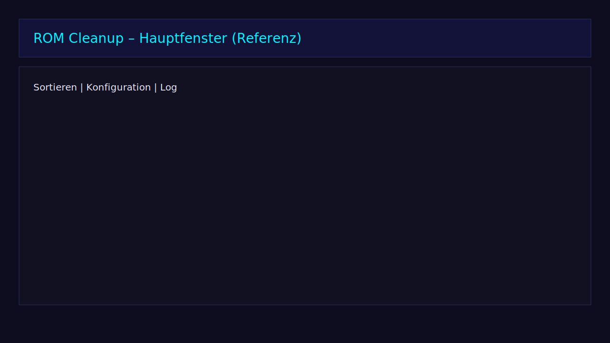
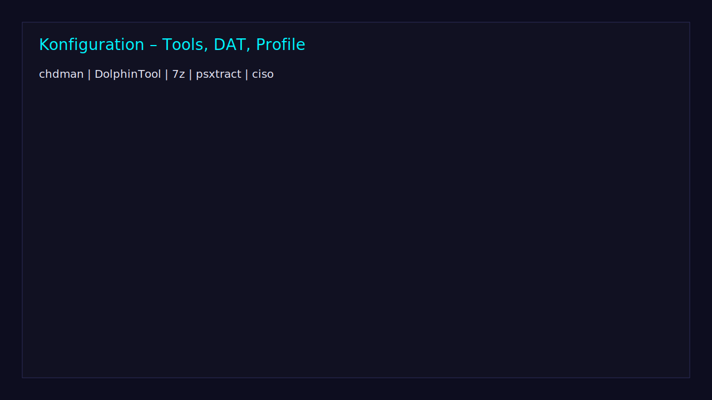

# User-Handbuch

**Stand:** 2026-03-15

---

## 1. Schnellstart

### GUI (WPF)

```bash
dotnet run --project src/RomCleanup.UI.Wpf
```

1. Im Tab **Sortieren** ROM-Ordner hinzufügen
2. Optional Trash-Pfad setzen
3. Modus wählen (**DryRun** = Vorschau, **Move** = Ausführen)
4. **Sortierung starten**

### CLI (headless)

```bash
# DryRun (nur Vorschau)
dotnet run --project src/RomCleanup.CLI -- --roots "D:\Roms" --mode DryRun

# Move mit Region-Bevorzugung
dotnet run --project src/RomCleanup.CLI -- --roots "D:\Roms" --mode Move --regions EU,US
```

### REST API

```bash
dotnet run --project src/RomCleanup.Api
```

API läuft auf `http://127.0.0.1:7878` (nur loopback).

## 2. Screenshots





## 3. GUI-Übersicht (WPF)

Die WPF-GUI basiert auf MVVM (`MainViewModel.cs`) mit Dark-Theme und Neon-Accent:

| Tab | Inhalt |
|-----|--------|
| **Sortieren** | Root-Verwaltung, Modus-Wahl (DryRun/Move), Start/Cancel, Progress mit ETA |
| **Konfiguration** | Einstellungen, DAT-Mapping, Tool-Pfade, Theme |
| **Log & Dashboard** | Live-Log, Statistiken, Timeline |
| **Reports** | HTML/CSV-Reports |

### Modi

| Modus | Beschreibung |
|-------|-------------|
| **Einfach** | 4 Entscheidungen — für Einsteiger |
| **Experte** | Volle Kontrolle über alle Parameter |

**Empfohlener Flow:** DryRun → Summary prüfen → Bestätigen → Move

## 4. Wichtige Modi

- **DryRun**: Nur Vorschau/Analyse, keine Datei-Verschiebung. Standard beim ersten Lauf.
- **Move**: Führt Verschiebungen aus (nur mit expliziter Bestätigung im Summary-Dialog).

## 5. Konfiguration

### Settings-Pfad

`%APPDATA%\RomCleanupRegionDedupe\settings.json`

```jsonc
{
  "general": {
    "logLevel": "Info",
    "preferredRegions": ["EU","US","JP"],
    "aggressiveJunk": false,
    "aliasEditionKeying": false
  },
  "toolPaths": { "chdman": "", "7z": "", "dolphintool": "" },
  "dat": {
    "useDat": true,
    "datRoot": "",
    "hashType": "SHA1",
    "datFallback": true
  }
}
```

### Externe Tools

| Tool | Zweck |
|------|-------|
| `chdman` | CHD-Konvertierung (MAME) |
| `dolphintool` | RVZ-Konvertierung (Dolphin Emulator) |
| `7z` | Archiv-Handling |

Tool-Binaries werden gegen SHA256-Hashes aus `data/tool-hashes.json` verifiziert.

### DAT-Verifikation

- Hash-Typ: `SHA1`, `SHA256` oder `MD5`
- DAT-Root-Ordner konfigurierbar
- Unterstützte Quellen: No-Intro, Redump, FBNEO
- DAT-Download mit SHA256-Sidecar-Verifizierung

## 6. Sicherheit

- **Kein direktes Löschen** — Standard = Verschieben in Trash + Audit-Log
- **Path-Traversal-Schutz** — Moves nur innerhalb definierter Roots
- **Reparse-Point-Blocking** — Symlinks/Junctions werden explizit blockiert
- **Zip-Slip-Schutz** — Archiv-Pfade vor Extraktion validiert
- **CSV-Injection-Schutz** — Keine führenden `=`, `+`, `-`, `@` in Reports
- **Tool-Hash-Verifizierung** — SHA256 vor jedem Tool-Aufruf
- **XXE-Schutz** — Beim DAT-XML-Parsing aktiv
- **API-Sicherheit** — `X-Api-Key`-Header, Rate-Limiting (120/min), CORS, nur 127.0.0.1

## 7. Rollback

Jede Operation erzeugt ein signiertes Audit-CSV. Rollback über:

1. **GUI:** Rückgängig-Button oder `Ctrl+Z`
2. **Rollback-Wizard:** Audit-CSV auswählen → Vorschau → Bestätigen

## 8. Format-Bewertung (Winner-Selection)

Die Deduplizierung wählt das beste Format pro Spiel. Die Auswahl ist **deterministisch**.

| Format | Score |
|--------|-------|
| CHD | 850 |
| ISO | 700 |
| RVZ | 700 |
| CSO | 600 |
| ZIP | 500 |
| 7Z | 480 |
| RAR | 400 |

**Winner-Selection Reihenfolge:**
1. Kategorie-Filter (GAME vs. JUNK vs. BIOS)
2. Regions-Score (bevorzugte Region aus `preferredRegions` = 1000−N)
3. Format-Score
4. Versions-Score (Verified `[!]` = +500; Revision a-z = 10×Ordinalwert)
5. Größen-Tiebreak (Disc → größer; Cartridge → kleiner)

## 9. Erkennungs-Pipeline

| Stufe | Methode | Konfidenz |
|-------|---------|-----------|
| 1 | DAT Hash Match (SHA1/MD5/CRC32) | 100% |
| 2 | Archiv-Inhalt (eindeutige Extensions) | 70% |
| 3 | Disc-Header (ISO/BIN) | 95% |
| 4 | DolphinTool Disc-ID (GC/Wii) | 90% |
| 5a | Ordner-Name-Erkennung | 50% |
| 5b | Eindeutige Extension (.gba, .nes, .nds) | 60% |
| 5c | Dateiname-Regex | 30% |
| 6 | UNKNOWN + Reason-Code | 0% |

Weitere Details: siehe `docs/UNKNOWN_FAQ.md`

## 10. Konvertierungs-Pipeline

| Konsole | Zielformat | Tool |
|---------|-----------|------|
| PS1, Saturn, Dreamcast | CHD | `chdman createcd` |
| PS2 | CHD | `chdman createdvd` |
| GameCube, Wii | RVZ | `dolphintool` |
| PSP (PBP) | CHD | `psxtract` |
| NES, SNES etc. | ZIP | `7z` |

## 11. Reporting

| Format | Beschreibung |
|--------|-------------|
| **HTML-Report** | Interaktiver Report mit Diagrammen, CSP-Header |
| **CSV-Audit** | SHA256-signiert, alle Moves/Actions dokumentiert |
| **JSON-Summary** | `{ Status, ExitCode, Preflight, ReportPath, AuditPath }` |
| **JSONL-Logs** | Strukturierte Logs mit Correlation-ID und Phase-Metriken |

## 12. CLI-Nutzung

```bash
# DryRun
dotnet run --project src/RomCleanup.CLI -- --roots "D:\ROMs" --mode DryRun

# Move mit Region-Bevorzugung
dotnet run --project src/RomCleanup.CLI -- --roots "D:\ROMs" --mode Move --regions EU,US
```

Exit-Codes: `0` = Erfolg, `1` = Fehler, `2` = Abgebrochen, `3` = Preflight fehlgeschlagen.

## 13. REST API

```bash
# Starten (API-Key via Umgebungsvariable)
set ROM_CLEANUP_API_KEY=mein-key
dotnet run --project src/RomCleanup.Api
```

| Methode | Pfad | Zweck |
|---------|------|-------|
| `GET` | `/health` | Health-Check |
| `GET` | `/openapi` | OpenAPI-Spec |
| `POST` | `/runs` | Run erstellen |
| `GET` | `/runs/{id}` | Run-Status |
| `GET` | `/runs/{id}/result` | Ergebnis |
| `POST` | `/runs/{id}/cancel` | Abbrechen |
| `GET` | `/runs/{id}/stream` | SSE-Fortschritt |

**Request-Body für `/runs`:**
```json
{
  "roots": ["D:\\ROMs"],
  "mode": "DryRun",
  "preferRegions": ["EU", "US"]
}
```

**Authentifizierung:** `X-Api-Key`-Header mit dem Wert aus `ROM_CLEANUP_API_KEY`.

## 14. Troubleshooting

| Problem | Lösung |
|---------|--------|
| Fehlende Tools | Tool-Pfade in Settings konfigurieren |
| DAT-Fehler | DAT-Root und Hash-Typ prüfen |
| UNBEKANNT-Dateien | Siehe `docs/UNKNOWN_FAQ.md` |
| API-Fehler 401 | `X-Api-Key` Header setzen |
| API-Fehler 429 | Rate-Limit (120/min) abwarten |
| Rollback fehlgeschlagen | Audit-CSV prüfen, Quell-/Zielpfade noch vorhanden? |
